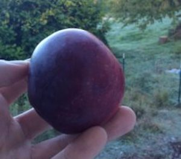
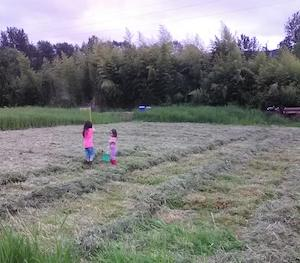

Our mission is to help people in our local community find better food, stronger community, and more resilient living by connecting together, and by connecting to this place we call home.

You can read a bit more about our approach on our [about page](about.html), and you can [follow us on Facebook](https://www.facebook.com/EchoLakeResearch/).

## Attend a workshop! {.blue}

If you are near the Maltby WA we would love to have you stop by for an in-person workshop. They are designed to give you immediately valuable skills that will let you live better. Email jason@echolakeresearch.org for more information.

## Focus areas

| [ Gardening](./gardening) |      | Health            |
| :----------------------------------------------------------- | ---- | ------------------------------------------------------------ |
| Convenient classes that give you practical skills to build a more local, resilient, community centered life. Get more food, medicine and joy from your garden with less time and a smaller budget! These classes and workshops are designed to make an immediate impact in your life. [Learn more...](./gardening) |      | Elderberries are one of the most important medicinal plants we can grow. They are attested to by modern science and thousands of years of tradition. We are on a mission to organize planting them by the thousands, using them as a stepping stone to transform the health of our families and communities. |

 

| Community                 |      | Food               |
| ------------------------------------------------------------ | ---- | ------------------------------------------------------------ |
| We are developing simple resources for a grassroots program to help you vitalize your community, starting with simple and rewarding steps in your own neighborhood. We can rediscover the tight-knit communities that we are made for. |      | We are collecting, growing and breeding some of the most delicious and toughest crops that exist for our region. From perennial grains and drought tolerant corn to heritage fruit trees and prickly pear, and things you've probably never heard of before! |

 

| Crops              |      | Permaculture Design |
| ------------------------------------------------------------ | ---- | ------------------------------------------------------------ |
| We are collecting, growing and breeding some of the very toughest staple crops that exist for our region. From pest resistant potatoes to drought tolerant corn, and from perennial grains to uncommon staples like sunroots. |      | Agroforestry is managing forest land to produce food, medicine, and other high value products in addition to lumber. We want to meet landowners with acreage in or near the Echo Lake area who are interested in exploring in agroforestry work with us. If that sounds like you or someone you might know, please contact jason@echolakeresearch.org! |

