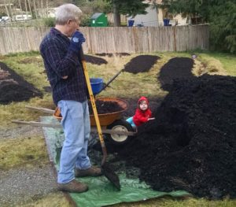
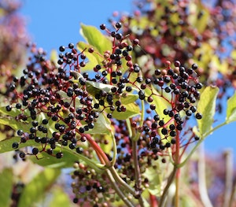

Echo Lake Research {.honey}
==

Our mission is to help people in our local community find better food, stronger community, and more resilient living by connecting together, and by connecting to this place we call home.

You can read a bit more about our approach on our [about page](about.html), and you can [follow us on Facebook](https://www.facebook.com/EchoLakeResearch/).

## Start learning, keep learning! {.blue}

You can click around the menu at the top of the page for simple guides to help you localize your life.

If you are in or around the neighborhood of Echo Lake & Maltby, you can take some of the in person classes we teach. Each class is designed to give you immediately practical takeaway skills that will make your life better, while saving time and money.

Email jason@echolakeresearch.org to get notified about upcoming classes, and free online live videos and webinars.

### More Topics {.brown}

If it floats your boat, you can also peruse resources for [Permaculture Design](/permaculture) and check out info about the [Crops](/crops) we are growing and breeding.

## Projects

| Natural Living Classes |      |  Elderberry Medicine      |
| :----------------------------------------------------------- | ---- | ------------------------------------------------------------ |
| Convenient classes that give you practical skills to build a more local, resilient, community centered life. Get more food, medicine and joy from your garden with less time and a smaller budget! These classes and workshops are designed to make an immediate impact in your life. |      | Elderberries are one of the most important medicinal plants we can grow. They are attested to by modern science and thousands of years of tradition. We are on a mission to organize planting them by the thousands, using them as a stepping stone to transform the health of our families and communities. |

 

| Community                                                    |      | Heritage Fruit                                               |
| ------------------------------------------------------------ | ---- | ------------------------------------------------------------ |
| We are developing simple resources for a grassroots program to help you vitalize your community, starting with simple and rewarding steps in your own neighborhood. We can rediscover the tight-knit communities that we are made for. |      | Nothing is quite like a Washington apple picked from a storied neighborhood tree, and we are working to preserve and share the oldest ones in our area. You can get involved by connecting us with old trees, coming to a grafting event, and growing local heritage fruit trees! |

 

| Resilient Crops                                              |      | Agroforestry                                                 |
| ------------------------------------------------------------ | ---- | ------------------------------------------------------------ |
| We are collecting, growing and breeding some of the very toughest staple crops that exist for our region. From pest resistant potatoes to drought tolerant corn, and from perennial grains to uncommon staples like sunroots. |      | Agroforestry is managing forest land to produce food, medicine, and other high value products in addition to lumber. We want to meet landowners with acreage in or near the Echo Lake area who are interested in exploring in agroforestry work with us. If that sounds like you or someone you might know, please contact jason@echolakeresearch.org! |

